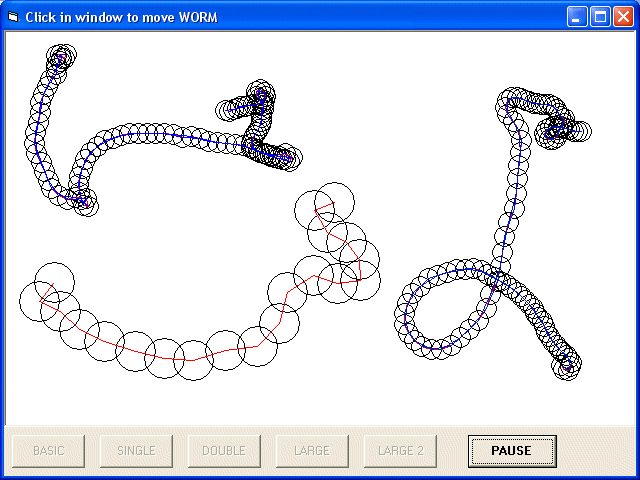



## Worm Spring

### Description

Super Worm - particles, springs, mass, force, velocity.

Each piece moves, not just the ends.

Each Piece has mass and is connected to others by springs.

Very powerful and interesting maths.
 
### More Info
 

             |
---                |---
**Submitted On**   |2005-09-20 17:17:02
**By**             |[Jason Bullen](https://github.com/Planet-Source-Code/PSCIndex/blob/master/ByAuthor/jason-bullen.md)
**Level**          |Beginner
**User Rating**    |5.0 (10 globes from 2 users)
**Compatibility**  |VB 5\.0, VB 6\.0
**Category**       |[Math/ Dates](https://github.com/Planet-Source-Code/PSCIndex/blob/master/ByCategory/math-dates__1-37.md)
**World**          |[Visual Basic](https://github.com/Planet-Source-Code/PSCIndex/blob/master/ByWorld/visual-basic.md)
**Archive File**   |[Worm\_Sprin198565472006\.zip](https://github.com/Planet-Source-Code/jason-bullen-worm-spring__1-64927/archive/master.zip)

